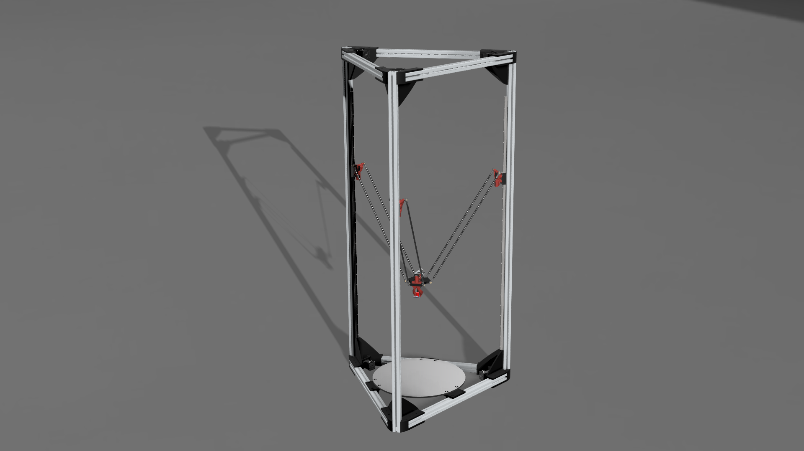

# Deltra - Delta 3D Printer

## Overview

Deltra is a high-performance delta 3D printer purpose-built for large-format printing. With an impressive 500x737mm build volume and a maximum flowrate of 100mm³/s, the Deltra delivers exceptional speed and quality for demanding print jobs. Featuring dual 48V axis drives, this printer is engineered to handle challenging prints with precision and reliability.

## Documentation

This repository contains all the files necessary to build and maintain a Deltra printer, including:

- **[CAD/](./CAD/)** - Complete 3D models in Fusion 360 (.f3z) and 3MF formats
- **[BOM/](./BOM/)** - Bill of Materials for printer construction
- **[Electronics/](./Electronics/)** - Electrical schematics and PCB designs
- **[Klipper/](./Klipper/)** - Klipper firmware configuration files and macros

## Quick Start

### Prerequisites
- Familiarity with 3D printer assembly and electronics
- Knowledge of Klipper firmware configuration
- Necessary tools for assembly (see BOM)

### Getting Started
1. Review the [Bill of Materials](./BOM/README.md) for all required components
2. Download and review the [CAD models](./CAD/) for assembly reference
3. Review the [Electronics](./Electronics/) documentation
4. Configure Klipper using the provided [configuration files](./Klipper/)

## Klipper Configuration

The Klipper folder contains pre-configured settings for the Deltra printer:

- `printer.cfg` - Main printer configuration
- `includes.cfg` - Included configuration files
- `params.cfg` - Parameter definitions
- `print.cfg` - Print-specific settings
- `autotune_tmc.cfg` - TMC motor tuning
- Additional macro and speed configuration files
## Important Notes

⚠️ **Please Note:** This Printer was a diploma-thesis and was a one off build. All files for building this printer are available, but this project won't be actively maintained by us

## Contributing

Contributions and improvements are welcome! Please feel free to fork this project to help improve the Deltra printer project.